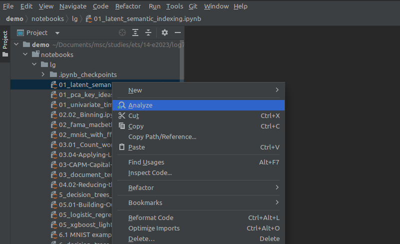
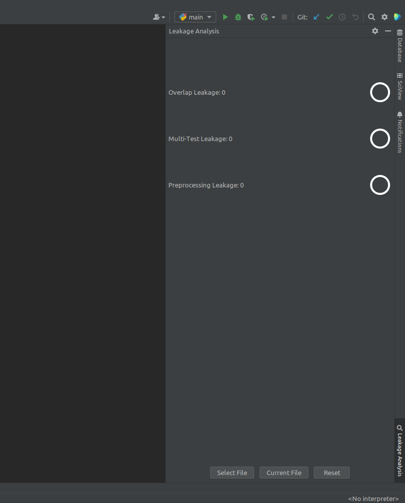

# PFE032

<!-- Plugin description -->

## Description
PFE032 is a plugin to detect data leakage in python files and Jupyter Notebooks. It uses a fork of [leakage-analysis](https://github.com/malusamayo/leakage-analysis) 
to detect leakages. The project currently detects three types of leakage:

- Overlap leakage
- Pre-processing leakage
- No independence test data

The plugin enables the user to select one or multiple files and to see what types of leakages are present as well as 
the line in the code at which the leakage happens.

This [project](https://github.com/guipreg/PFE032), as well as the [fork of leakage-analysis](https://github.com/guipreg/leakage-analysis)
and the original [leakage-analysis](https://github.com/malusamayo/leakage-analysis) are open source and contributions are welcome.

<!-- Plugin description end -->

## Build and run plugin

1. Build and run docker container
   1. Open a terminal in the project directory
   2. ``docker compose up --build``
2. Deploy plugin
   1. <kbd>Gradle tool window</kbd> > <kbd>PFE032</kbd> > <kbd>Tasks</kbd> > <kbd>intellij</kbd> >
      <kbd>buildPlugin</kbd>
   2. The plugin zip file can be found in ``build/distributions``
3. Install plugin
   1. <kbd>File</kbd> > <kbd>Settings</kbd> > <kbd>Plugins</kbd> > <kbd>⚙️</kbd> > <kbd>Install Plugin from Disk...</kbd>

## Usage

### Menu Action

1. In the project view, right-click on a Jupyter Notebook file or folder
2. Click on the ``Analyze`` menu action to analyze
    - If it's a folder, it will check for all the Jupyter Notebook files and run the analysis for each

3. The results are displayed in the **Leakage Analysis** window

4. You can also use the buttons:
- ``Select File`` to use a file explorer to analyse a specific file
- ``Current File`` to analyse the currently opened file
- ``Reset`` to reset the tool window and erase previous detections

---
Plugin based on the [IntelliJ Platform Plugin Template][template].

[template]: https://github.com/JetBrains/intellij-platform-plugin-template

[docs:plugin-description]: https://plugins.jetbrains.com/docs/intellij/plugin-user-experience.html#plugin-description-and-presentation